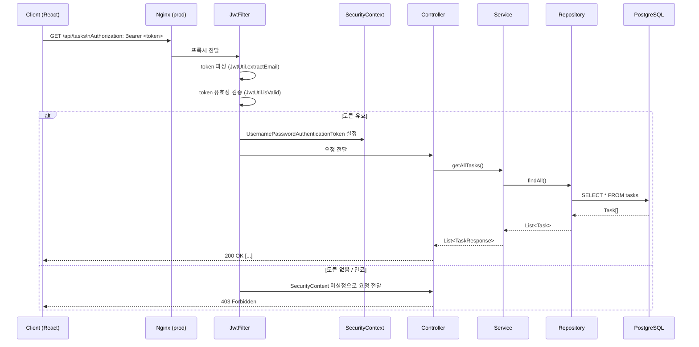

# 데이터 흐름

## 인증된 API 요청의 전체 경로



## 회원가입 데이터 흐름

```
Client
  → POST /api/auth/register {name, email, password}
  → AuthController.register()
  → AuthService.register()
    → UserRepository.existsByEmail()   -- 중복 확인
    → BCryptPasswordEncoder.encode()   -- 비밀번호 해싱
    → UserRepository.save()            -- DB 저장
    → JwtUtil.generateToken()          -- JWT 생성
  → AuthResponse {token, email, name}
  → 200 OK
```

## 핵심 컴포넌트 데이터 변환

```
HTTP Body (JSON)
  → @RequestBody + @Valid              (Controller)
  → DTO (RegisterRequest, TaskRequest) (Controller → Service)
  → Entity (User, Task)               (Service → Repository)
  → DB Row                            (Repository → PostgreSQL)

DB Row
  → Entity                            (Repository)
  → DTO (TaskResponse, AuthResponse)  (Service → Controller)
  → JSON Response                     (Controller)
```

> **Entity를 직접 반환하지 않는 이유**: 순환 참조(JSON 직렬화), 불필요한 필드 노출(password 해시 등), API 계약과 DB 스키마 분리를 위해 DTO 변환 레이어를 둡니다.
