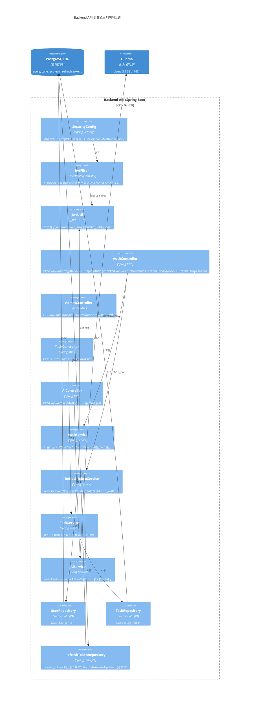
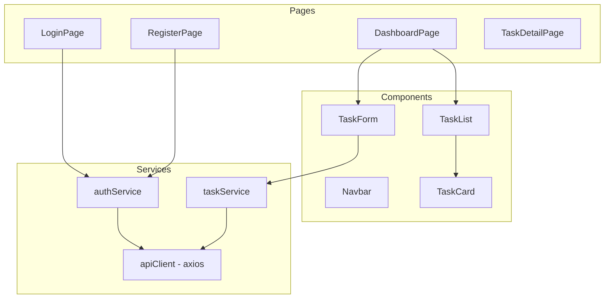

# 컴포넌트 다이어그램 (C4 Level 3)

## Backend API 내부 컴포넌트



## Frontend 컴포넌트 (예정)



## 패키지 구조

```
com.taskhive
├── config/         # JwtUtil, JwtFilter, SecurityConfig
├── controller/     # AuthController, TaskController
├── service/        # AuthService, TaskService
├── repository/     # UserRepository, TaskRepository
├── model/          # User, Task, Project (JPA Entity)
└── dto/            # LoginRequest, RegisterRequest, AuthResponse
```
