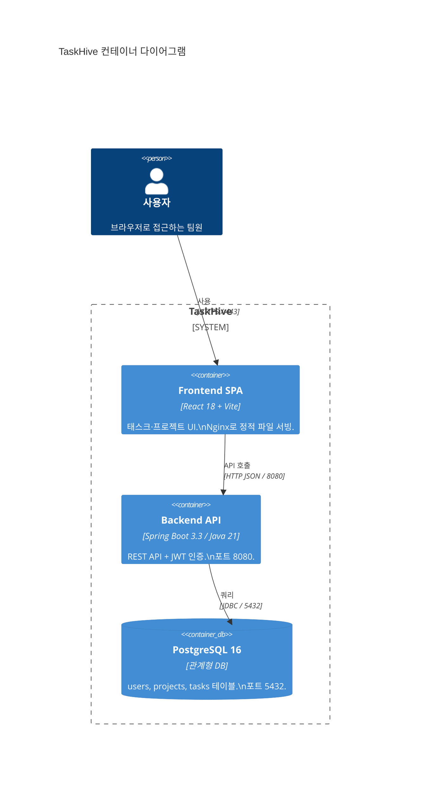

# 컨테이너 다이어그램 (C4 Level 2)

## TaskHive 내부 컨테이너 구성



## 컨테이너 상세

| 컨테이너 | 기술 | 책임 | 포트 |
|---------|------|------|------|
| **Frontend SPA** | React 18 + TypeScript 5 + Vite 5 | UI 렌더링, 상태 관리, API 통신 | 3000 (dev) / 443 (prod) |
| **Backend API** | Spring Boot 3.3, Java 21 | 비즈니스 로직, JWT 인증, REST API | 8080 |
| **PostgreSQL** | PostgreSQL 16-alpine | 영속 데이터 저장, 관계형 모델 | 5432 |

## 로컬 개발 (Docker Compose)

```
docker-compose.yml
├── postgres   → postgres:16-alpine
├── backend    → Dockerfile (./backend)
└── frontend   → Dockerfile (./frontend)
```

Nginx(`/etc/nginx/conf.d/default.conf`):
- `/api/*` → `backend:8080` 프록시
- `/*` → `/usr/share/nginx/html` 정적 파일

## 프로덕션 (Kubernetes)

```
k8s/
├── namespace.yaml
├── backend/   → Deployment(replicas=2) + Service + ConfigMap
├── frontend/  → Deployment(replicas=2) + Service
├── database/  → StatefulSet + PVC + Service
└── ingress.yaml  → nginx-ingress
```
