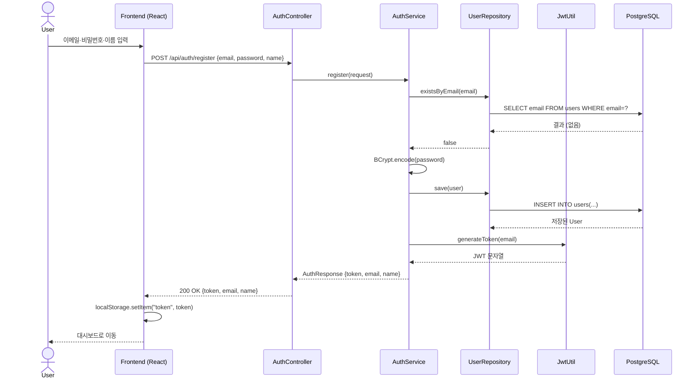
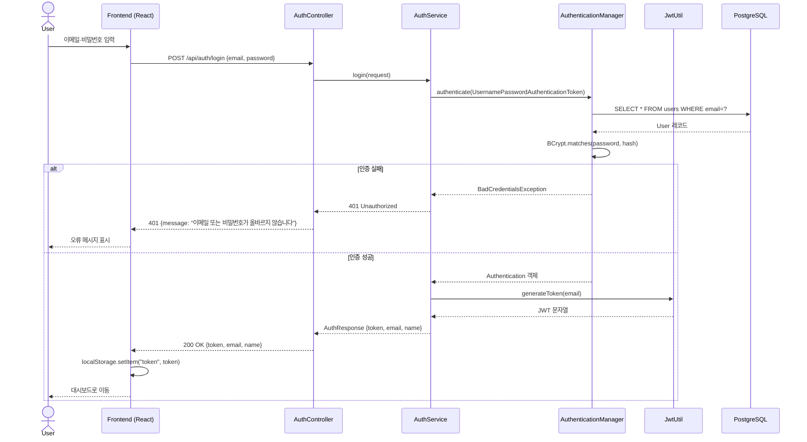

# 회원가입·로그인 시퀀스 다이어그램

## 회원가입 (POST /api/auth/register)

## 로그인 (POST /api/auth/login)

## JWT 유효기간 및 갱신 정책

| 항목 | 값 |
|------|-----|
| 토큰 유효기간 | 24시간 (86,400,000ms) |
| 갱신 방식 | 재로그인 (Refresh Token 미구현) |
| 저장 위치 | `localStorage` (클라이언트) |
| 만료 시 처리 | 401 응답 → 로그인 페이지 리다이렉트 |
