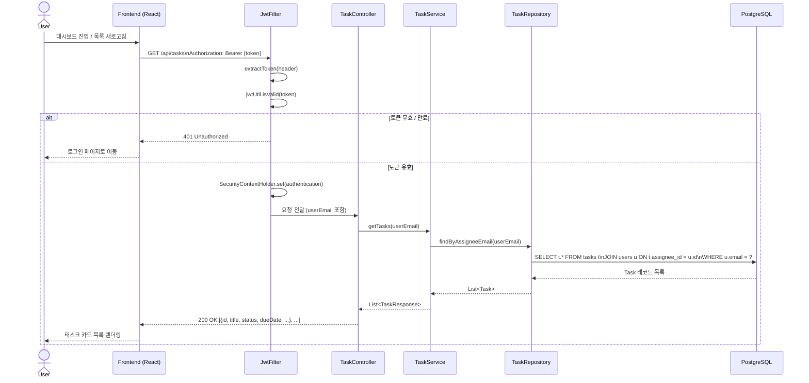
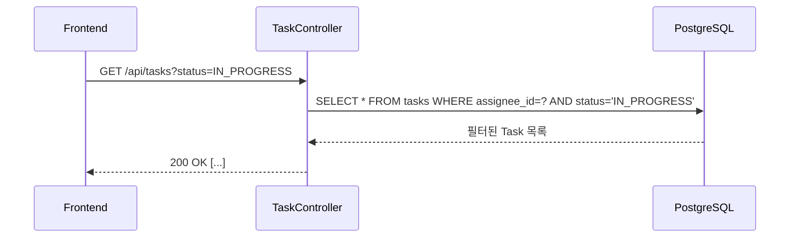
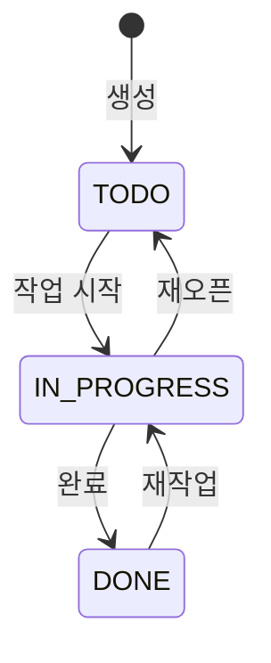

# 태스크 목록 조회 시퀀스 다이어그램

## GET /api/tasks



## 태스크 상태 필터링 (확장 예정)



## 응답 예시

### GET /api/tasks 응답 (성공 — 200)
```json
[
  {
    "id": 1,
    "title": "API 명세 작성",
    "description": "REST API Markdown 문서 작성",
    "status": "IN_PROGRESS",
    "dueDate": "2026-06-01",
    "createdAt": "2026-05-10T09:00:00Z"
  },
  {
    "id": 2,
    "title": "프론트엔드 로그인 UI",
    "description": "React 로그인 폼 구현",
    "status": "TODO",
    "dueDate": "2026-06-15",
    "createdAt": "2026-05-11T14:00:00Z"
  }
]
```

### 빈 목록 (정상)
```json
[]
```

## Task.Status 전이


