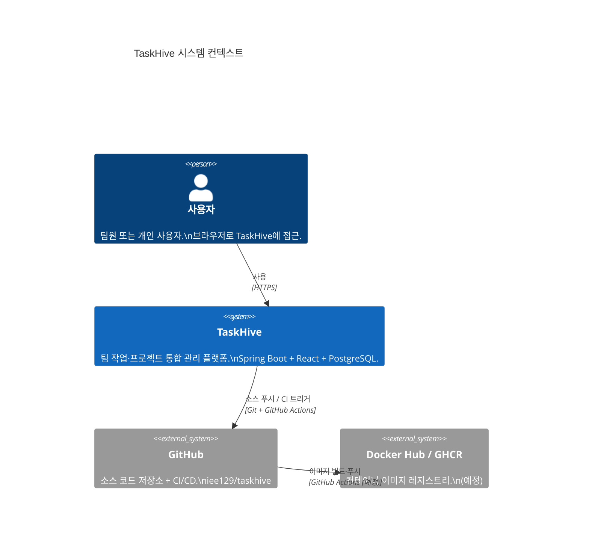

# 시스템 컨텍스트 다이어그램 (C4 Level 1)

## 외부 시스템 관계

## 텍스트 설명

| 액터/시스템 | 역할 |
|------------|------|
| **사용자** | 브라우저로 React SPA에 접근하여 태스크·프로젝트를 관리 |
| **TaskHive** | 프론트엔드(React) + 백엔드(Spring Boot) + DB(PostgreSQL) |
| **GitHub** | 코드 저장, PR 관리, GitHub Actions CI 실행 |
| **GHCR** | Docker 이미지 저장소 (Phase 6 구현 예정) |
