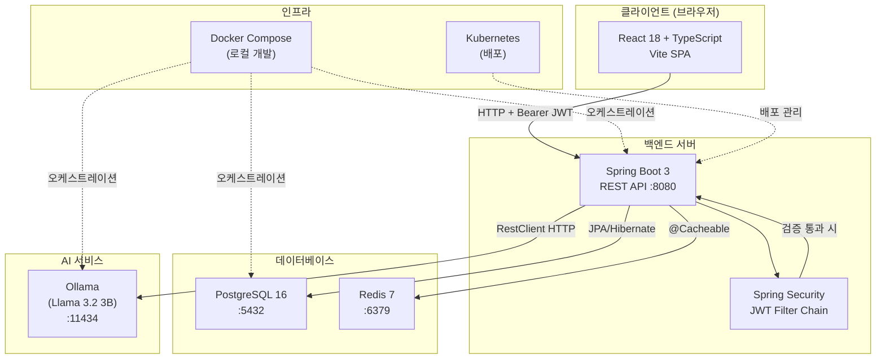
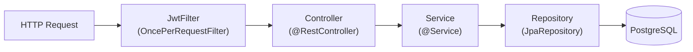

# 시스템 아키텍처 개요

## 전체 구성

TaskHive는 프론트엔드 SPA, 백엔드 REST API, PostgreSQL DB의 3-티어 아키텍처입니다.

## 백엔드 레이어 구조

| 레이어 | 패키지 | 책임 |
|--------|--------|------|
| Controller | `com.taskhive.controller` | HTTP 요청/응답 처리, 유효성 검사 위임 |
| Service | `com.taskhive.service` | 비즈니스 로직, 트랜잭션 관리 |
| Repository | `com.taskhive.repository` | DB CRUD, Spring Data JPA 인터페이스 |
| Model | `com.taskhive.model` | JPA Entity (테이블 매핑) |
| DTO | `com.taskhive.dto` | API 요청/응답 객체 (Entity 노출 방지) |
| Config | `com.taskhive.config` | Security, JWT, CORS 설정 |

## 인증 흐름 요약

1. 클라이언트 → `POST /api/auth/login` → JWT 발급
2. 클라이언트 → 이후 모든 요청에 `Authorization: Bearer <jwt>` 헤더 포함
3. `JwtFilter` → 토큰 파싱 → SecurityContext 설정
4. Spring Security → 인가 결정
