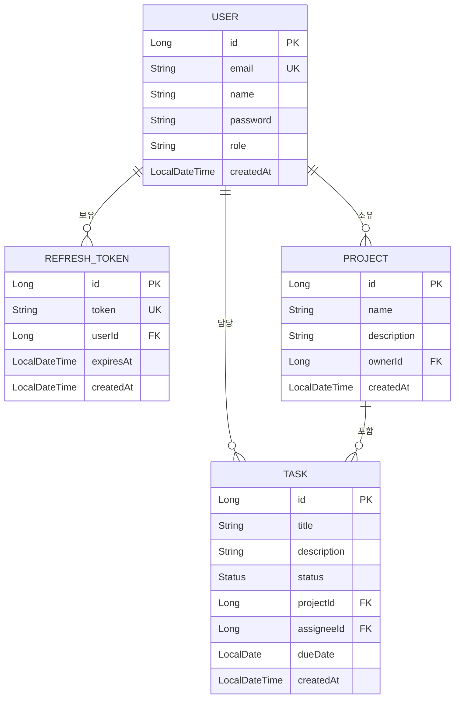
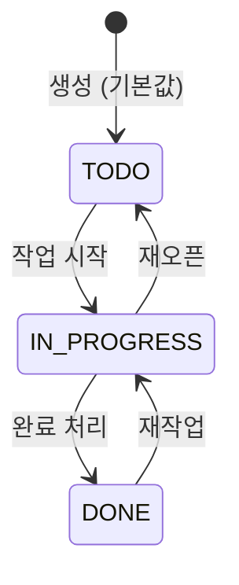

# 도메인 모델

## Entity 관계도



## Entity 상세

### User

```java
@Entity @Table(name = "users")
public class User {
    @Id @GeneratedValue(strategy = GenerationType.IDENTITY)
    private Long id;

    @Column(unique = true, nullable = false)
    private String email;

    @Column(nullable = false)
    private String name;

    @Column(nullable = false)
    private String password;           // BCrypt 해시

    @Enumerated(EnumType.STRING)
    @Column(nullable = false)
    @Builder.Default
    private Role role = Role.USER;     // USER | ADMIN

    @CreationTimestamp
    private LocalDateTime createdAt;
}
```

### RefreshToken

```java
@Entity @Table(name = "refresh_tokens")
public class RefreshToken {
    @Id @GeneratedValue(strategy = GenerationType.IDENTITY)
    private Long id;

    @Column(nullable = false, unique = true, length = 512)
    private String token;

    @ManyToOne(fetch = FetchType.EAGER)
    @JoinColumn(name = "user_id", nullable = false)
    private User user;

    @Column(nullable = false)
    private LocalDateTime expiresAt;

    @Column(nullable = false, updatable = false)
    private LocalDateTime createdAt;

    public boolean isExpired() { return LocalDateTime.now().isAfter(expiresAt); }
}
```

### Task

```java
@Entity @Table(name = "tasks")
public class Task {
    @Id @GeneratedValue(strategy = GenerationType.IDENTITY)
    private Long id;

    @Column(nullable = false)
    private String title;

    private String description;

    @Enumerated(EnumType.STRING)
    @Column(nullable = false)
    private Status status = Status.TODO;

    @ManyToOne(fetch = FetchType.LAZY)
    @JoinColumn(name = "project_id")
    private Project project;

    @ManyToOne(fetch = FetchType.LAZY)
    @JoinColumn(name = "assignee_id")
    private User assignee;

    private LocalDate dueDate;

    @CreationTimestamp
    private LocalDateTime createdAt;

    public enum Status { TODO, IN_PROGRESS, DONE }
}
```

## Task.Status 상태 전이



## 비즈니스 규칙

| 규칙 | 설명 |
|------|------|
| 이메일 유일성 | `users.email`은 UNIQUE 제약 — 중복 가입 불가 |
| 비밀번호 저장 | 평문 저장 금지 — BCrypt 해시만 저장 |
| 기본 역할 | 회원가입 시 `Role.USER` 자동 부여 |
| Task 기본 상태 | 생성 시 `TODO`로 초기화 |
| Refresh Token Rotation | `/refresh` 호출 시 기존 토큰 삭제 후 신규 발급 |
| Soft Delete | 현재 미구현 — `DELETE` 시 실제 행 삭제 |
| 소유권 검증 | Task 수정·삭제 전 `assignee.email == jwtEmail` 검증 (예정) |
