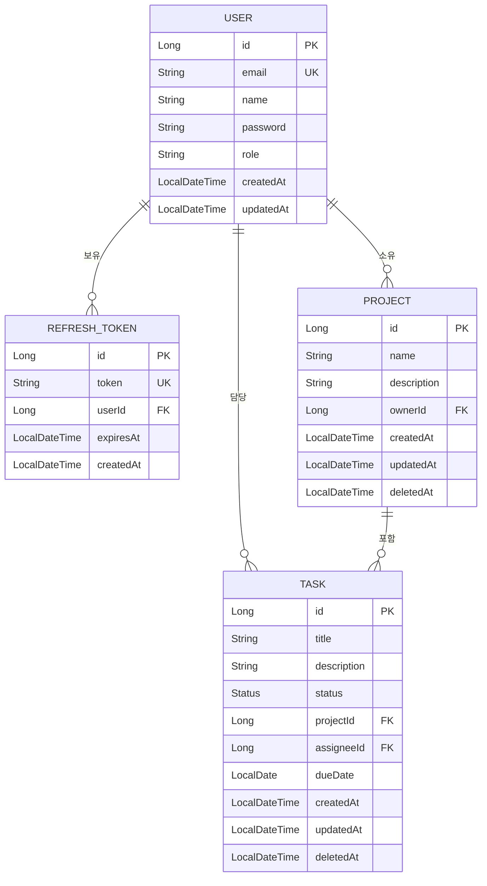
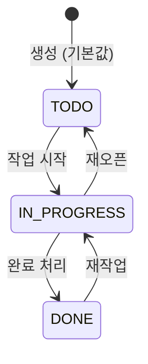

# 도메인 모델

## Entity 관계도



## BaseEntity

`User`, `Task`, `Project`가 공통으로 상속하는 `@MappedSuperclass`.  
JPA Auditing(`@EnableJpaAuditing`)으로 타임스탬프를 자동 관리합니다.

```java
@MappedSuperclass
@EntityListeners(AuditingEntityListener.class)
@Getter
public abstract class BaseEntity {

    @CreatedDate
    @Column(name = "created_at", nullable = false, updatable = false)
    private LocalDateTime createdAt;

    @LastModifiedDate
    @Column(name = "updated_at", nullable = false)
    private LocalDateTime updatedAt;
}
```

## Entity 상세

### User

```java
@Entity @Table(name = "users")
public class User extends BaseEntity {
    @Id @GeneratedValue(strategy = GenerationType.IDENTITY)
    private Long id;

    @Column(unique = true, nullable = false)
    private String email;

    @Column(nullable = false)
    private String name;

    @Column(nullable = false)
    private String password;           // BCrypt 해시

    @Enumerated(EnumType.STRING)
    @Column(nullable = false)
    @Builder.Default
    private Role role = Role.USER;     // USER | ADMIN
}
```

### RefreshToken

```java
@Entity @Table(name = "refresh_tokens")
public class RefreshToken {
    @Id @GeneratedValue(strategy = GenerationType.IDENTITY)
    private Long id;

    @Column(nullable = false, unique = true, length = 512)
    private String token;

    @ManyToOne(fetch = FetchType.EAGER)
    @JoinColumn(name = "user_id", nullable = false)
    private User user;

    @Column(nullable = false)
    private LocalDateTime expiresAt;

    @Column(nullable = false, updatable = false)
    private LocalDateTime createdAt;

    public boolean isExpired() { return LocalDateTime.now().isAfter(expiresAt); }
}
```

### Project

```java
@Entity @Table(name = "projects")
public class Project extends BaseEntity {
    @Id @GeneratedValue(strategy = GenerationType.IDENTITY)
    private Long id;

    @Column(nullable = false)
    private String name;

    private String description;

    @ManyToOne(fetch = FetchType.LAZY)
    @JoinColumn(name = "owner_id", nullable = false)
    private User owner;

    @OneToMany(mappedBy = "project", cascade = CascadeType.ALL)
    private List<Task> tasks;

    @Column(name = "deleted_at")
    private LocalDateTime deletedAt;   // null이면 활성 프로젝트
}
```

### Task

```java
@Entity @Table(name = "tasks")
public class Task extends BaseEntity {
    @Id @GeneratedValue(strategy = GenerationType.IDENTITY)
    private Long id;

    @Column(nullable = false)
    private String title;

    private String description;

    @Enumerated(EnumType.STRING)
    @Column(nullable = false)
    private Status status = Status.TODO;

    @ManyToOne(fetch = FetchType.LAZY)
    @JoinColumn(name = "project_id")
    private Project project;

    @ManyToOne(fetch = FetchType.LAZY)
    @JoinColumn(name = "assignee_id")
    private User assignee;

    private LocalDate dueDate;

    @Column(name = "deleted_at")
    private LocalDateTime deletedAt;   // null이면 활성 태스크

    public enum Status { TODO, IN_PROGRESS, DONE }
}
```

## Task.Status 상태 전이



## 소프트 삭제 전략

`Task`와 `Project`는 `DELETE` 시 행을 물리 삭제하지 않고 `deleted_at`에 시각을 기록합니다.

| 동작 | 구현 |
|------|------|
| 삭제 | `entity.setDeletedAt(LocalDateTime.now())` |
| 목록 조회 | `findAllByDeletedAtIsNull()` |
| 단건 조회 | `findByIdAndDeletedAtIsNull(id)` |
| 존재하지 않는 항목 | `BusinessException(TASK_NOT_FOUND)` / `PROJECT_NOT_FOUND` |

## 비즈니스 규칙

| 규칙 | 설명 |
|------|------|
| 이메일 유일성 | `users.email`은 UNIQUE 제약 — 중복 가입 불가 |
| 비밀번호 저장 | 평문 저장 금지 — BCrypt 해시만 저장 |
| 기본 역할 | 회원가입 시 `Role.USER` 자동 부여 |
| Task 기본 상태 | 생성 시 `TODO`로 초기화 |
| Refresh Token Rotation | `/refresh` 호출 시 기존 토큰 삭제 후 신규 발급 |
| 소유권 검증 | Project 수정·삭제 전 `owner.email == authentication.getName()` 검증 |
| 소프트 삭제 | Task·Project `DELETE` → `deleted_at` 기록, 목록 쿼리에서 자동 제외 |
