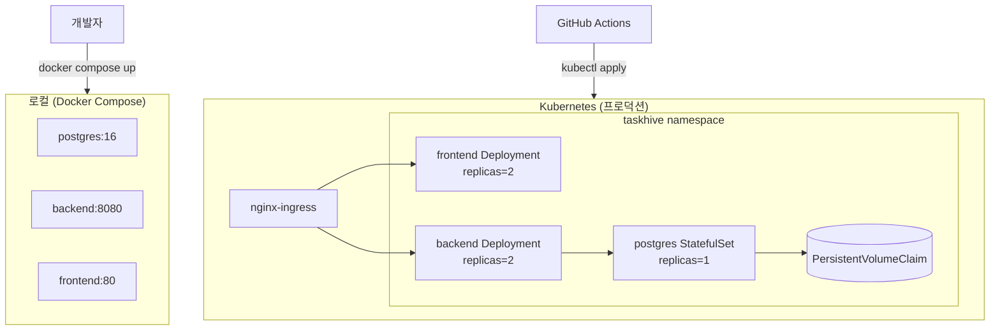

# 인프라 개요

## 환경별 스택

| 환경 | 오케스트레이션 | 목적 |
|------|--------------|------|
| 로컬 개발 | Docker Compose | 개발자 로컬 실행 |
| CI | GitHub Actions | 빌드·테스트 자동화 |
| 프로덕션 | Kubernetes | 배포·스케일링·자동복구 |

## 아키텍처 개요

## 컨테이너 이미지

| 서비스 | Dockerfile 위치 | 베이스 이미지 |
|--------|----------------|-------------|
| backend | `backend/Dockerfile` | `eclipse-temurin:21-jre-alpine` |
| frontend | `frontend/Dockerfile` | `node:20-alpine` + `nginx:alpine` |
| postgres | Docker Hub 공식 | `postgres:16-alpine` |

## 포트 매핑

| 서비스 | 컨테이너 포트 | 로컬 노출 포트 |
|--------|-------------|-------------|
| postgres | 5432 | 5432 |
| backend | 8080 | 8080 |
| frontend | 80 | 3000 |
